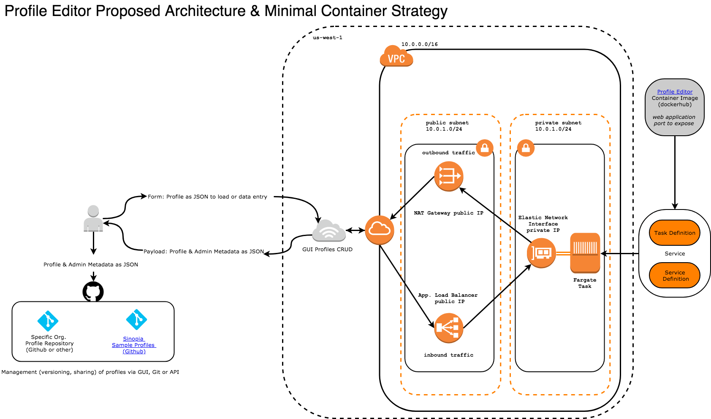
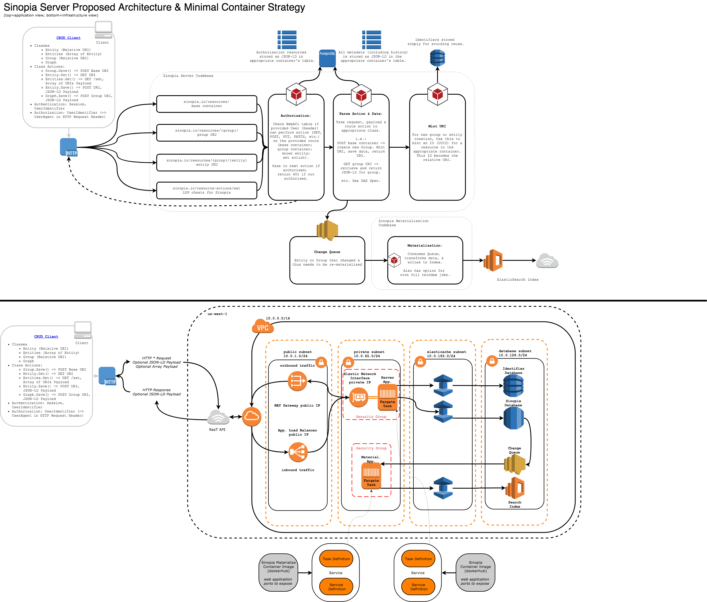

Here are various views, diagrams, and notes on the overall Sinopia architecture. This page is likely to change (and change often) as we work through implementations in our current work cycle. A lot of the following has overlap with the defined [Sinopia Data Models](/sinopia/models).

All of the following diagrams should be accessible in [this open Google drive folder as well](https://drive.google.com/drive/folders/12MOb3GjBYBK3KZEN0QdGBMuerot7627q?usp=sharing).

# Conceptual Architectural

This is a high-level diagram of the full Sinopia system and it's components. Where feasible at a high level, sub-system interactions and protocols are documented here:

<small>[link to diagram](https://docs.google.com/drawings/d/1FdgAeWT2xAaXBWLw2MWHK1tIEC1q_ls56VX3gPiZUcM/edit)</small>

# Architectural Components

### Sinopia Profile Editor

<small>[link to diagram, requires Draw.io Google Drive Add-on to Edit](https://drive.google.com/file/d/19MjuEht4oKJC3ICoKHDJAut8vog7EL7w/view?usp=sharing)</small>

### Sinopia Front-End

<small>[link to diagram](https://docs.google.com/drawings/d/1AeO7_UqecQoPGgrDIdsfTJi6_PRkHnldqHRIbfP8ZCo/edit)</small>

### Sinopia Server & Data Materialization

<small>[link to diagram, requires Draw.io Google Drive Add-on to Edit](https://drive.google.com/file/d/1hqLoObnmQ-HEtgJSqfN0SoKZH9OmO3xb/view?usp=sharing)</small>

### Integration Points & Interfaces (External ReST APIs or other)

WIP. See [the work here](/sinopia/external-data) that is specifically about Sinopia Editor & QA-inspired Lookup API interactions.

# Dataflow & Interaction Diagram

These are a list of "dataflow" and sequence diagrams to help unravel the expected and supported Sinopia system interactions. These are a level or two below some of the UX/UI work, focusing on the underlying systems.

### Overall 'Dataflow' Diagrams

<small>[link to diagram](https://docs.google.com/drawings/d/1FoMgCn6FqAHN0W_lpkZOZF4G5ezkSxf6iWrBgg1SLQw/edit)</small>

### Login & First Steps
1. Authentication
2. Administrative Landing Page (website)
   1. Favorites or Most Used Profiles List
   2. Profiles Search
   3. WIP or Draft Data Entry (Stretch)
   4. Internal Instance Data Search
3. Authorization

### Create New Profile

### Loading Profile

Option 1: Select Profile from Most Used
   1. Profile pulled from database
   2. Profile loaded into Editor
   3. User redirected to Editor with that Profile (next step)

Option 2: Search & Select Profile
  1. Enter Profile search term (label, author, date, keyword) in Profiles search
  2. View Profile results (list of Profile metadata)
  3. User selects profile
  4. Profile pulled from database
  5. Profile loaded into Editor
  6. User redirected to Editor with that Profile (next step)

### Edit Existing Profile

### Delete Existing Profile

### Create New Entity

<small>[link to diagram](https://docs.google.com/drawings/d/14hRHdepWbYrZn5jzfBxXY210H_a3FutAYZV5Mj82ZM4/edit)</small>

### Create New Entity with Context

### Edit Existing Entity

### Delete Existing Entity

### Sinopia / QA Form Type-Ahead

### Sinopia / QA Form Contextual Lookup

<small>[link to diagram](https://docs.google.com/drawings/d/1Bo-hCtPg1gQVJZWtVdbJGLo74_GM4RL7tfotnU6HTPs/edit)</small>

### Sinopia / QA External Keyword Search

### Sinopia / Internal Form Type-Ahead

### Sinopia / Internal Form Contextual Lookup

### Sinopia / Internal Keyword Search

### Sinopia / Internal Faceted Search

# Original Whiteboard Photos

See https://drive.google.com/drive/u/1/folders/1ynnPhdQGRDMkrpEpcmsjxBD5TqpovoBS
